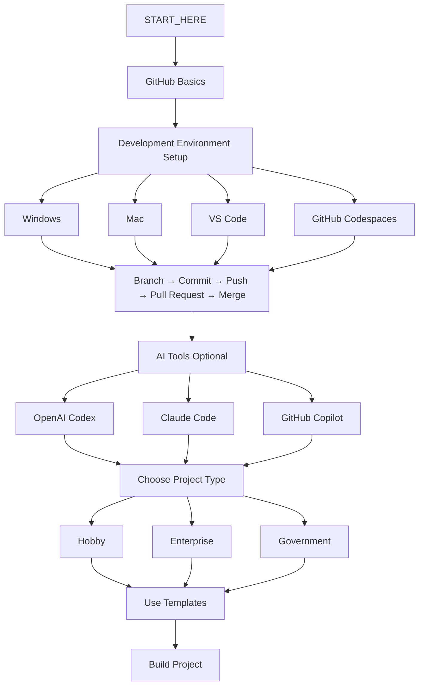
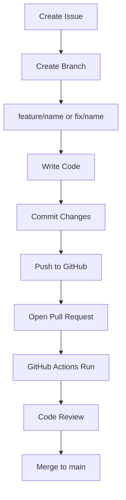
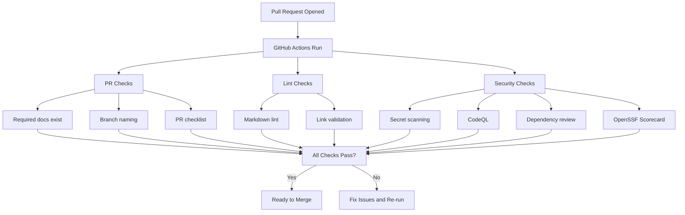
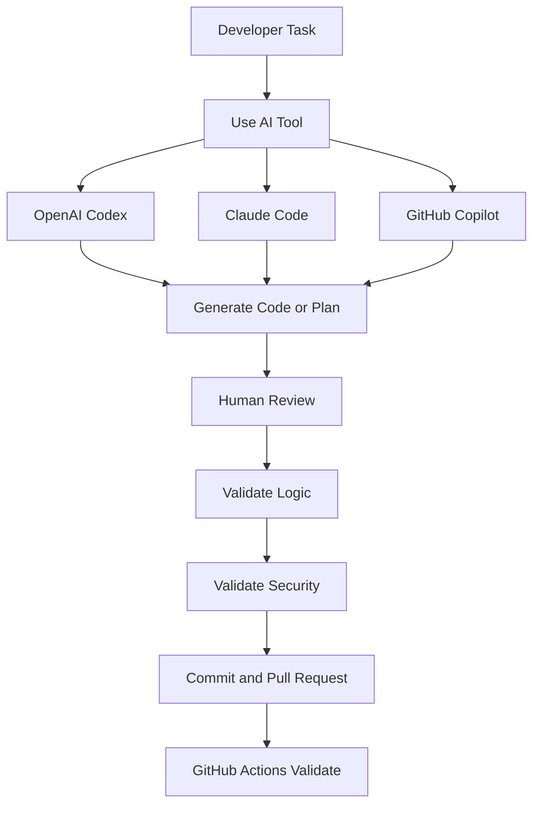
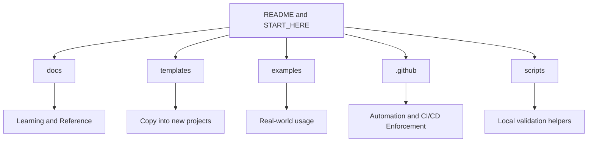
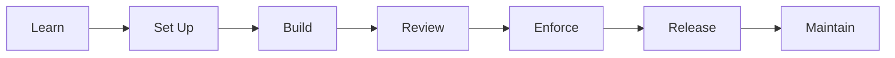

# Visual Guide

This page shows the main workflows in this repository as diagrams.

> **Viewing tip:** These render automatically on GitHub. If you see raw text instead of diagrams, open this file on github.com (not raw view).

---

## Learning and Setup Flow

---

## Daily Developer Workflow

---

## GitHub Actions Enforcement Flow

---

## AI-Assisted Development Flow

---

## Repository Structure Mental Model

---

## Simple System Summary

